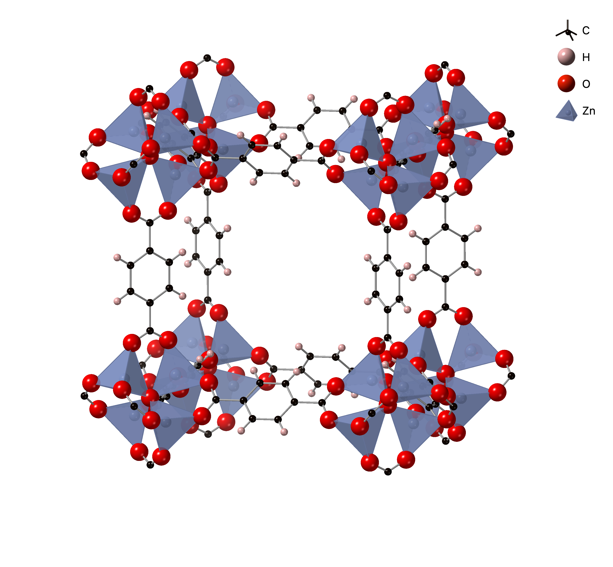

# Predicting heat capacity in gas-loaded porous materials

**How does a porous material respond to heat when its pores are filled with gas?**
This project combines molecular simulation and machine-learning interatomic
potentials to estimate the heat capacity of metal–organic frameworks (MOFs)
loaded with methane, carbon dioxide, or water.

MOFs are crystalline materials built from metal atoms joined by organic
molecules. Their open, repeating structures contain pores that can hold guest
molecules. Understanding how those molecules move and interact with the host
helps describe the material's thermal behavior—a useful question in the study
of porous materials for gas storage and separation.

## A look inside MOF-5

The image below shows part of the repeating MOF-5 structure. The blue
polyhedra mark zinc–oxygen coordination units; carbon, hydrogen, and oxygen
atoms are shown as spheres and bonds. The open spaces between these connected
building blocks are where guest molecules can be placed in the simulations.

<p align="center">
  
</p>

## What this project does

The workflow estimates heat capacity across a temperature range by combining
two views of the material:

- **Molecular dynamics** follows the loaded framework and guest molecules as
  they move, capturing thermal motion and anharmonic interactions.
- **Machine-learning Hessians** describe small vibrations around optimized
  structures and add a quantum correction to the classical simulation.

In plain terms, the simulations capture the material's changing, thermal
behavior, while the vibration calculations account for effects that a purely
classical model misses. The result is an approximate constant-pressure heat
capacity curve for the loaded material. The workflow also uses a separate
empty-framework reference calculation; it does not run empty-framework MD.

The original methane-loaded MOF-5 campaign remains the default. Other supported
guests are CO₂ and H₂O, and the workflow can use additional periodic MOF
structures.

## Quick start

The production workflow runs on the EPFL SCITAS Izar cluster and uses a GPU.
After setting up the environment and model dependencies, a typical campaign is
prepared and submitted from the repository root with:

```bash
./scripts/md/submit_loaded_md.sh --model pet-mad --loading 100 --dry-run
```

`--dry-run` prepares and checks the campaign without submitting jobs. To choose
a different host, guest, or molecule count, add options such as:

```bash
./scripts/md/submit_loaded_md.sh --model pet-mad --mof mof5 --guest co2 --loading 100 --dry-run
```

Here, `--loading 100` means 100 guest molecules in the simulation cell. The
follow-on property workflow analyzes completed trajectories and computes the
heat-capacity estimate; its steps and commands are in the
[property workflow guide](scripts/properties/README.md).

## How the workflow is organized

1. Prepare a periodic crystal structure and place the requested guest
   molecules inside its pores.
2. Run classical constant-pressure molecular dynamics (NPT) at a series of
   temperatures.
3. Analyze the trajectories and calculate vibrational corrections for
   representative loaded structures and an empty-framework reference.
4. Combine the classical and quantum contributions into a heat-capacity curve.

The project separates simulation, structure preparation, and analysis code so
that completed trajectories can be analyzed without rerunning molecular
dynamics. See the [MD guide](scripts/md/README.md) for inputs and campaign
options, and [MOF-5 scientific notes](docs/MOF-5.md) for the method's rationale,
assumptions, and limitations.

## Setup

```bash
conda env create --file environment.yml
conda activate mof
./scripts/setup/install_sadmof.sh
```

The environment is pinned for Izar's V100 GPUs. Read the
[Izar guide](docs/IZAR.md) before running cluster jobs. More technical
background is available in the [SADMOF notes](docs/SADMOF.md),
[PET model notes](docs/PET.md), and [LLPR ensemble notes](docs/LLPR.md).

## Repository map

```text
mof_heat_capacity/   simulation, structure, and analysis package
configs/             reusable run specifications
input/               source MOF structures and guest templates
scripts/             campaign and property workflow commands
docs/                scientific background and cluster guidance
output/              generated structures, trajectories, logs, and results
```

Generated models, trajectories, analysis products, logs, and outputs are local
artifacts and are not included in version control.
